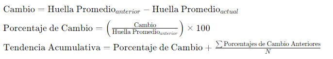
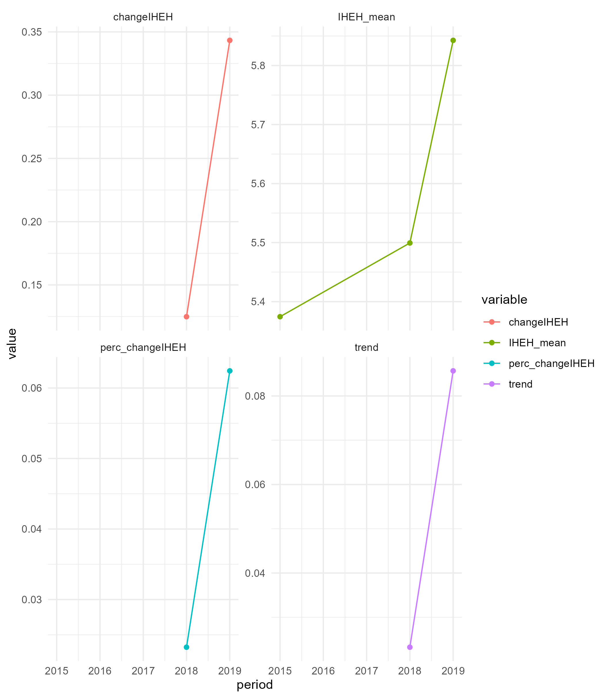

Flujo de trabajo VariationHumanFootprintSpecialAreas – Indicador de
Variación en la huella humana en áreas de manejo especial en Colombia
================

Esta rutina está diseñada para estimar el Indicador de Variación en la
huella humana en áreas de manejo especial en Colombia. Esto refleja
información sobre los cambios en la presión y el impacto de las
actividades humanas en zonas que, aunque no están diseñadas para la
conservación de la biodiversidad, son gestionadas con el propósito de
asegurar el bienestar de las comunidades locales. Las áreas de manejo
especial tienen como objetivo principal mejorar la calidad de vida de
las comunidades que las habitan. Sin embargo, el bienestar de estas
comunidades está estrechamente vinculado a la salud y diversidad del
entorno natural que las rodea.

Proporciona información sobre cómo los cambios en la presión y el
impacto de las actividades humanas están ejerciendo presión sobre la
biodiversidad en estas áreas. Al hacerlo, se puede entender mejor cómo
estas presiones afectan la capacidad del entorno para continuar
brindando los servicios necesarios para el bienestar de las comunidades
locales.

- [Organizar directorio de trabajo](#organizar-directorio-de-trabajo)
- [Establecer parámetros de sesión](#establecer-parámetros-de-sesión)
  - [Cargar librerias/paquetes necesarios para el
    análisis](#cargar-libreriaspaquetes-necesarios-para-el-análisis)
- [Establecer entorno de trabajo](#establecer-entorno-de-trabajo)
  - [Definir inputs y direccion
    output](#definir-inputs-y-direccion-output)
- [Cargar insumos](#cargar-insumos)
- [Estimar huella promedio por periodo en areas de manejo
  especial](#estimar-huella-promedio-por-periodo-en-areas-de-manejo-especial)
- [Estimar huella promedio por
  periodo](#estimar-huella-promedio-por-periodo)
- [Estimar cambio respecto al periodo anterior y
  tendencia](#estimar-cambio-respecto-al-periodo-anterior-y-tendencia)
- [Plot de cambio y tendencia](#plot-de-cambio-y-tendencia)
- [Exportar resultados](#exportar-resultados)

El ejemplo documentado estima genera resultados para las zonas de manejo
especial en el área total de Colombia
(`input$studyArea = file.path(input_folder, "studyArea", "ColombiaDeptos.gpkg"`).
Sin embargo, el código está diseñado para estimar el indicador en
cualquier polígono espacial de Colombia. Por ejemplo, el script adjunto
incluye un ejemplo para un departamento particular
(`input$studyArea = file.path(input_folder, "studyArea", "antioquia.shp"`),
que, al ser una ventana más pequeña, facilita la validación del código.
Si se desea estimar el indicador para otro polígono, se debe cambiar la
ruta `input$studyArea` en la [sección de código para la definición de
entradas](#ID_inputs). Asimismo, el código admite diferentes insumos de
huella por periodo y diferentes insumos de polígonos de zonas de manejo
especial, siempre que se definan correctamente según lo descrito en la
sección de entradas citada.

## Organizar directorio de trabajo

<a id="ID_seccion1"></a>

Las entradas de ejemplo de este ejercicio están almacenadas en
[IAvH/Unidades
compartidas/MBI/VariationHumanFootprintSpecialAreas](https://drive.google.com/open?id=18Bs1g79OWTwYBjLeMvi-MdIKRmk3o33B&usp=drive_fs).
Una vez descargadas, reemplaza la carpeta “input” en el directorio donde
está guardado este código con la carpeta “input” de la descarga. El
directorio está organizado de esta manera que facilita la ejecución del
código:

    script
    │- Script_VariationHumanFootprintSpecialAreas
    │    
    └-input
    │ │
    │ └- studyArea
    │ │   │
    │ │   │- studyArea.gpkg
    │ │
    │ │
    │ └- SpecialAreas
    │ │   │
    │ │   │- SpecialAreas_1.gpkg
    │ │   │- ...
    │ │   │- SpecialAreas_n.gpkg
    │ │
    │ │
    │ └- HumanFootprint
    │     │
    │     │- HumanFootprint_tiempo_1.tif
    │     │- ...
    │     │- HumanFootprint_tiempo_n.tif
    │     
    └-output

## Establecer parámetros de sesión

### Cargar librerias/paquetes necesarios para el análisis

``` r
## Establecer parámetros de sesión ####
### Cargar librerias/paquetes necesarios para el análisis ####

#### Verificar e instalar las librerías necesarias ####
packagesPrev <- installed.packages()[,"Package"]  
packagesNeed <- librerias <- c("this.path", "magrittr", "dplyr", "plyr", "pbapply", "data.table", "raster", "terra", "sf", "ggplot2", 
                               "tidyr", "reshape2","openxlsx")  # Define los paquetes necesarios para ejecutar el codigo
new.packages <- packagesNeed[!(packagesNeed %in% packagesPrev)]  # Identifica los paquetes que no están instalados
if(length(new.packages)) {install.packages(new.packages, binary = TRUE)}  # Instala los paquetes necesarios que no están previamente instalados

#### Cargar librerías ####
lapply(packagesNeed, library, character.only = TRUE)  # Carga las librerías necesarias
```

## Establecer entorno de trabajo

El flujo de trabajo está diseñado para establecer el entorno de trabajo
automáticamente a partir de la ubicación del código. Esto significa que
tomará como `dir_work` la carpeta raiz donde se almacena el código
“~/scripts. De esta manera, se garantiza que la ejecución se realice
bajo la misma organización descrita en el paso de [Organizar directorio
de trabajo](#ID_seccion1).

``` r
## Establecer entorno de trabajo ####
dir_work <- this.path::this.path() %>% dirname()  # Establece el directorio de trabajo
```

### Definir inputs y direccion output

Dado que el código está configurado para definir las entradas desde la
carpeta input, en esta parte se debe definir una lista llamada input en
la que se especifica el nombre de cada una de las entradas necesarias
para su ejecución. Para este ejemplo, basta con usar file.path con
referencia a `input_folder` y el nombre de los archivos para definir su
ruta y facilitar su carga posterior. No obstante, se podría definir
cualquier ruta de la máquina local como carpeta input donde se almacenen
las entradas, o hacer referencia a cada archivo directamente.

Asimismo, el código genera una carpeta output donde se almacenarán los
resultados del análisis. La ruta de esa carpeta se almacena por defecto
en el mismo directorio donde se encuentra el código.

Este código ejecuta una serie de análisis espaciales a partir de
archivos espaciales. Todas las entradas espaciales deben tener el mismo
sistema de coordenadas. En este flujo de trabajo, toda la información
cartográfica se maneja en el sistema de coordenadas WGS84 (EPSG:4326).
El código puede ejecutarse en cualquier sistema de coordenadas, siempre
y cuando todos los insumos espaciales tengan la misma proyección. Se
pueden usar distintos tipos de vectores espaciales (por ejemplo, .gpkg,
.geoJson, .shp). En este ejemplo, se utiliza .gpkg por ser el más
eficiente para análisis espaciales.

<a id="ID_inputs"></a>

``` r
### Definir entradas necesarias para la ejecución del análisis ####

# Definir la carpeta de entrada-insumos
input_folder<- file.path(dir_work, "input"); # "~/input"

# Crear carpeta output
output<- file.path(dir_work, "output"); dir.create(output)

#### Definir entradas necesarias para la ejecución del análisis ####
input <- list(
  studyArea= file.path(input_folder, "studyArea", "ColombiaDeptos.gpkg"),  # Ruta del archivo espacial que define el área de estudio
  time_IHEH_List= list( # Lista de rutas de archivos espaciales que representan huella humana en diferentes años. Deben tener los mismos rangos de valor para ser comparables (ej. 0 a 100) , extension y sistema de coordenadas.  Cada elemento en la lista se nombra con el año correspondiente al que representa el archivo de heulla humana. Esto permitira ordenarlos posteriormente
    "2015"= file.path(input_folder, "HumanFootprint", "IHEH_2015.tif"), # Indice de huella humana para Colombia del año 2015 IAvH
    "2018"= file.path(input_folder, "HumanFootprint", "IHEH_2018.tif"), # Indice de huella humana para Colombia del año 2018 IAvH
    "2019"= file.path(input_folder, "HumanFootprint", "IHEH_2019.tif")  # Indice de huella humana para Colombia del año 2019 IAvH
  ),
  AME_List= list( # Lista de rutas de archivos espaciales que representan areas de manejo especial
    "ResguardosIndigenas"= file.path(input_folder, "SpecialAreas", "Resguardos_ANT2024.gpkg") # Resguardos indigenas formalizados en Colombia - Agencia nacional de tierras 2024
  )
  )
```

La lista de entradas incluye `studyArea` como la ruta al archivo
espacial del área de estudio.

La lista `AME_List` recopila las rutas de los archivos espaciales
correspondientes a áreas de manejo especial. Cada elemento de la lista
representa la delimitación de un tipo específico de zona de manejo. Para
este ejercicio, se utilizaron exclusivamente las zonas de resguardos
indígenas formalizados según la [Agencia Nacional de Tierras de Colombia
(ANT)](https://data-agenciadetierras.opendata.arcgis.com/search). Es
importante que cada elemento de la lista sea nombrado de acuerdo con el
tipo de área que representa, para facilitar la exploración y análisis de
los resultados.

Por último, la entrada de la lista `time_IHEH_List` compila las rutas de
archivos espaciales formato `.tif` de capas de huella espacial humana en
diferentes momentos. En este caso, se utilizaron los raster de [capas de
huella desarrollados por el Instituto Humboldt para los años 2015, 2018,
y
2019](http://geonetwork.humboldt.org.co/geonetwork/srv/spa/catalog.search#/metadata/3f37fa6b-5290-4399-9ea3-eaafcd0b2fbe).
Es importante que los nombres de cada elemento a cargar se especifiquen
con años numéricos, ya que esto será útil para organizar el análisis de
cambio y tendencias posterior.

## Cargar insumos

``` r
## Cargar insumos ####

# Este codigo maneja toda la informacion cartografica en el sistema de coordenadas WGS84 4326 https://epsg.io/4326
sf::sf_use_s2(F) # desactivar el uso de la biblioteca s2 para las operaciones geométricas esféricas. Esto optimiza algunos analisis de sf.

### Cargar area de estudio ####
studyArea<- terra::vect(input$studyArea) %>% terra::buffer(0) %>% terra::aggregate() %>% sf::st_as_sf() # se carga y se disuleve para optimizar el analisis

### Cargar áreas de manejo especial ####
list_AME<- pblapply(names(input$AME_List), function(j) st_read(input$AME_List[[j]]) %>% dplyr::mutate(type_AME=j) )

#### Corte de áreas de manejo especial por area de estudio ####
ame<- pblapply(list_AME, function(type_ame) {
  test_crop_studyArea<- type_ame  %>%  st_crop( studyArea ) 
  test_intersects_studyArea<- sf::st_intersects(studyArea, test_crop_studyArea)  %>% as.data.frame()
  ame_studyArea<- st_intersection(studyArea[unique(test_intersects_studyArea$row.id)], test_crop_studyArea[test_intersects_studyArea$col.id,]) %>%  sf::st_set_geometry("geometry")
})  %>% plyr::rbind.fill() %>% st_as_sf() %>% dplyr::group_by(type_AME) %>%
  dplyr::summarise(across(geometry, ~ sf::st_combine(.)), .groups = "keep") %>% 
  dplyr::summarise(across(geometry, ~ sf::st_union(.)), .groups = "drop")

### Cargar capas de huella ####
list_IHEH<- pblapply(input$time_IHEH_List, function(x) terra::rast(x)  )
list_IHEH<- list_IHEH[sort(names(list_IHEH))] # ordenar por año


#### Corte de capas de huella por áreas de manejo especial en area de estudio ####
list_IHEH_studyArea<- pblapply(list_IHEH, function(layerIHEH) {
  layerIHEH_studyArea<- lapply(split(ame, ame$type_AME), function(x) {terra::crop(layerIHEH, x) %>% terra::mask(ame)})
})
```

Una vez cargados los insumos del área de estudio, con huella espacial en
diferentes períodos de tiempo, se realiza el corte de los mapas de capas
de huella por el área de estudio. El objeto `list_IHEH_studyArea`
corresponde a la representación espacial de esa intersección.

## Estimar huella promedio por periodo en areas de manejo especial

Con los insumos ajustados al área de estudio, para estimar la variación
del índice de huella espacial humana en el área de estudio, se calcula
el promedio de huella por período para cada tipo de área de manejo
especial.

``` r
## Estimar huella promedio por periodo en areas de manejo especial ####
IHEH_typeAME <- pblapply(names(list_IHEH_studyArea), function(i_testArea) {
  
  huella_AME<- lapply(names(list_IHEH_studyArea[[i_testArea]]), function(y) {
    data.frame(type_AME=y, period= i_testArea, IHEH_mean= mean(terra::values(list_IHEH_studyArea[[i_testArea]][[y]], na.rm=T)))
  }) %>% plyr::rbind.fill()
    
  }) %>% plyr::rbind.fill()

print(IHEH_typeAME)
```

| type_AME            | period | IHEH_mean |
|:--------------------|:-------|----------:|
| ResguardosIndigenas | 2015   |  5.374461 |
| ResguardosIndigenas | 2018   |  5.499366 |
| ResguardosIndigenas | 2019   |  5.842691 |

## Estimar huella promedio por periodo

Aunque es valiosa la información de la huella para cada tipo de área de
manejo especial, el objetivo del indicador es estimar la huella total
para todas las áreas de manejo en el área de estudio. Para ello, se
realiza una operación de agrupación y suma de las áreas calculadas de
manejo especial para cada período.

``` r
## Estimar huella promedio por  periodo ####
IHEH_AME<- IHEH_typeAME %>% dplyr::group_by(period) %>% dplyr::summarise(IHEH_mean= as.numeric(sum(IHEH_mean, na.rm=T)))
print(IHEH_AME)
```

| period | IHEH_mean |
|:-------|----------:|
| 2015   |  5.374461 |
| 2018   |  5.499366 |
| 2019   |  5.842691 |

## Estimar cambio respecto al periodo anterior y tendencia

Esta información permite realizar un seguimiento de las variaciones en
la huella para áreas de manejo especial. Nuestro objetivo es
estandarizar esa variación en un índice. Para ello, procedemos a estimar
el cambio respecto a un período definido. En este caso, estimamos el
cambio y el porcentaje de cambio de extensión respecto al último período
de medición, utilizando la fórmula de cambio: periodo anterior - periodo
actual, y el porcentaje de cambio como el cambio sobre el período
anterior.



Adicionalmente, calculamos la tendencia acumulativa de cambio, que
refleja la tendencia general de los cambios a lo largo del tiempo. La
tendencia acumulativa se obtiene sumando el porcentaje de cambio actual
y la media de los porcentajes de cambio de los periodos anteriores,
proporcionando una visión más integral de las tendencias de cambio
huella humana.

``` r
## Estimar cambio respecto al periodo anterior y tendencia ####
changeIHEH_AME<- IHEH_AME %>% dplyr::mutate(changeIHEH= NA, perc_changeIHEH= NA, trend=NA)
for(i in seq(nrow(changeIHEH_AME)) ){
if(i>1){
  changeIHEH_AME[i,"changeIHEH"]<- changeIHEH_AME[i,"IHEH_mean"]  - changeIHEH_AME[i-1,"IHEH_mean"] # estimar cambio en extension
  changeIHEH_AME[i,"perc_changeIHEH"]<-  changeIHEH_AME[i,"changeIHEH"] / changeIHEH_AME[i-1,"IHEH_mean"] # estimar cambio porcentual
  changeIHEH_AME[i,"trend"]<-  changeIHEH_AME[i,"perc_changeIHEH"] + ifelse(is.na(changeIHEH_AME[i-1,"perc_changeIHEH"]), 0, mean(unlist(changeIHEH_AME[2:i-1,"perc_changeIHEH"]), na.rm=T)) # estimar tendencia de cambio
  }
}

print(changeIHEH_AME)
```

| period | IHEH_mean | changeIHEH | perc_changeIHEH |     trend |
|:-------|----------:|-----------:|----------------:|----------:|
| 2015   |  5.374461 |         NA |              NA |        NA |
| 2018   |  5.499366 |  0.1249048 |       0.0232404 | 0.0232404 |
| 2019   |  5.842691 |  0.3433255 |       0.0624300 | 0.0856704 |

## Plot de cambio y tendencia

Por ultimo se ajustaron los resultados para visualización que permita
entender las tendencias obtenidas. Esto permite observar los cambios en
el indice de huella humana a traves del tiempo.

``` r
## Plot de cambio y tendencia ####
changeIHEH_AME_data<- changeIHEH_AME %>% dplyr::mutate(period= as.numeric(period))

changeIHEH_AME_plotdata<- tidyr::pivot_longer(changeIHEH_AME_data, cols = -period, names_to = "variable", values_to = "value")

changeIHEH_plot<- ggplot(changeIHEH_AME_plotdata, aes(x = period, y = value, color = variable)) +
  geom_line(group = 1) +
  geom_point() + facet_wrap(~ variable, scales = "free_y") + theme_minimal()

print(changeIHEH_plot)
```



Las áreas estimadas por periodos se presentan como valores absolutos, el
cambio en área como el delta entre los periodos comparados, mientras que
el porcentaje de cambio de área y la tendencia se representan en una
escala entre -1 y 1. En esta escala, -1 representa una pérdida de
extensión de capas de huella naturales en áreas de manejo especial con
potencial captura de carbono, y 1 indica que se mantuvo o se superó la
extensión de referencia. Esto permite una interpretación de las
dinamicas de cambio de la huella humana en áreas de manejo especial.

## Exportar resultados

``` r
## Exportar resultados
# Exportar tablas
openxlsx::write.xlsx(IHEH_AME, file.path(output, paste0("IHEH_AME", ".xlsx")))
openxlsx::write.xlsx(changeIHEH_AME, file.path(output, paste0("changeIHEH_AME", ".xlsx")))
# Exportar figuras
ggsave(file.path(output, paste0("results_trend", ".jpg")), changeIHEH_plot)

# exportar resultados espaciales
folder_IHEH_studyArea<- file.path(output, "IHEH_studyArea"); dir.create(folder_IHEH_studyArea)
export_rast<- pblapply(names(list_IHEH_studyArea), function(i_testArea) {
  layer<-  list_IHEH_studyArea[[i_testArea]]
  dir_layer<- file.path(folder_IHEH_studyArea,i_testArea ); dir.create(dir_layer)
  
  lapply(names(layer), function(j) {
    terra::writeRaster(layer[[j]], file.path(dir_layer, paste0(basename(folder_IHEH_studyArea),"_", i_testArea, "_", j, ".tif")), overwrite=T)
  })
  
})
```
