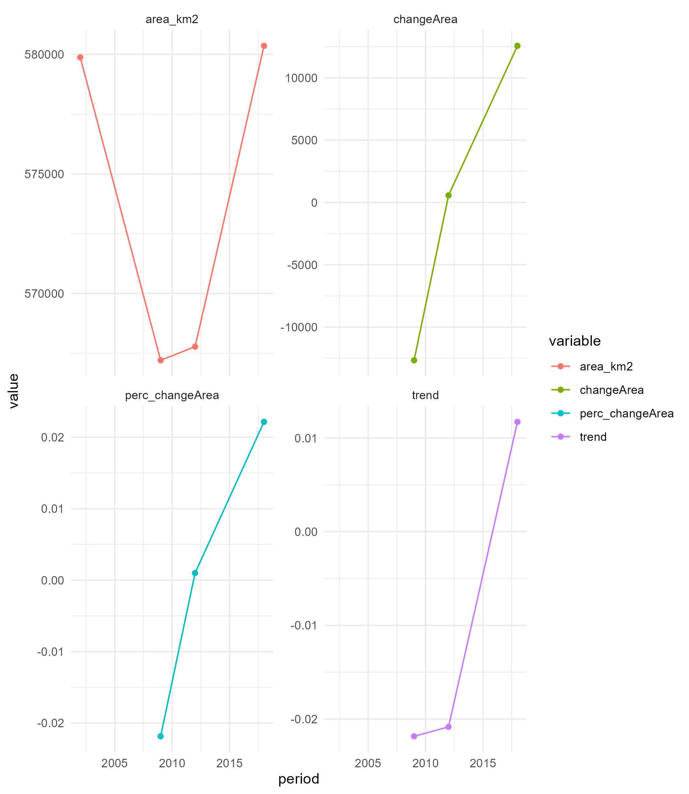

Flujo de trabajo VariationStrategicEcosystemsCarbonCapture – Indicador
de Variación del Área de Ecosistemas Estratégicos con Potencial de
Captura de Carbono
================
Esta rutina estima el Indicador de Variación del Área de Ecosistemas
Estratégicos con Potencial de Captura de Carbono en Colombia. Los
ecosistemas estratégicos en Colombia incluyen los bosques andinos, los
bosques secos, los humedales, los páramos y los manglares, que
desempeñan un papel fundamental en la captura y almacenamiento de
carbono por su capacidad de absorber CO2 de la atmósfera y almacenarlo
en la biomasa y el suelo, contribuyendo así a la regulación del ciclo
del carbono y la mitigación del cambio climático.

Bajo esta idea, cuantificar las variaciones de extensión de estos
ecosistemas brinda información sobre su capacidad para seguir capturando
carbono. Este índice mide los cambios en la extensión de coberturas
naturales en las zonas delimitadas como ecosistemas estratégicos en
Colombia. De manera que se describen tendencias de pérdida o ganancia de
áreas naturales de estos ecosistemas, lo cual es fundamental para
entender y mantener su potencial de captura de carbono.

El ejemplo documentado estima genera resultados para el área total de
Colombia
(`input$studyArea = file.path(input_folder, "studyArea", "ColombiaDeptos.gpkg"`).
Sin embargo, el código está diseñado para estimar el indicador en
cualquier polígono espacial de Colombia. Por ejemplo, el script adjunto
incluye un ejemplo para un departamento particular
(`input$studyArea = file.path(input_folder, "studyArea", "antioquia.shp"`),
que, al ser una ventana más pequeña, facilita la validación del código.
Si se desea estimar el indicador para otro polígono, se debe cambiar la
ruta `input$studyArea` en la [sección de código para la definición de
entradas](#ID_inputs). Asimismo, el código admite diferentes insumos de
cobertura por periodo y diferentes insumos de polígonos de ecosistemas
estratégicos, siempre que se definan correctamente según lo descrito en
la sección de entradas citada.

- [Organizar directorio de trabajo](#organizar-directorio-de-trabajo)
- [Establecer parámetros de sesión](#establecer-parámetros-de-sesión)
  - [Cargar librerias/paquetes necesarios para el
    análisis](#cargar-libreriaspaquetes-necesarios-para-el-análisis)
- [Establecer entorno de trabajo](#establecer-entorno-de-trabajo)
  - [Definir inputs y direccion
    output](#definir-inputs-y-direccion-output)
- [Cargar insumos](#cargar-insumos)
- [Estimar area de cobertura natural por ecosistema -
  periodo](#estimar-area-de-cobertura-natural-por-ecosistema---periodo)
- [Estimar area de cobertura natural por
  periodo](#estimar-area-de-cobertura-natural-por-periodo)
- [Estimar cambio respecto al periodo anterior y
  tendencia](#estimar-cambio-respecto-al-periodo-anterior-y-tendencia)
- [Plot de cambio y tendencia](#plot-de-cambio-y-tendencia)
- [Exportar resultados](#exportar-resultados)

## Organizar directorio de trabajo

<a id="ID_seccion1"></a>

Las entradas de ejemplo de este ejercicio están almacenadas en esta 
[carpeta](https://drive.google.com/file/d/1zkBMgH9evJPIaydnfZ-MtdWZ_X_8nU6m/view?usp=drive_link).
Una vez descargadas, reemplaza la carpeta “input” en el directorio donde
está guardado este código con la carpeta “input” de la descarga. El
directorio está organizado de esta manera que facilita la ejecución del
código:

    script
    │- Script_VariationStrategicEcosystemsCarbonCapture
    │    
    └-input
    │ │
    │ └- studyArea
    │ │   │
    │ │   │- studyArea.gpkg
    │ │
    │ │
    │ └- strategicEcosystems
    │ │   │
    │ │   │- StratEcoSystem_1.gpkg
    │ │   │- ...
    │ │   │- StratEcoSystem_n.gpkg
    │ │
    │ │
    │ └- covs
    │     │
    │     │- NatCovs_tiempo_1.gpkg
    │     │- ...
    │     │- NatCovs_tiempo_n.gpkg
    │     
    └-output

## Establecer parámetros de sesión

### Cargar librerias/paquetes necesarios para el análisis

``` r
## Establecer parámetros de sesión ####
### Cargar librerias/paquetes necesarios para el análisis ####

#### Verificar e instalar las librerías necesarias ####
packagesPrev <- installed.packages()[,"Package"]  
packagesNeed <- librerias <- c("this.path", "magrittr", "dplyr", "plyr", "pbapply", "data.table", "raster", "terra", "sf", "ggplot2", 
                               "tidyr", "reshape2","openxlsx")  # Define los paquetes necesarios para ejecutar el codigo
new.packages <- packagesNeed[!(packagesNeed %in% packagesPrev)]  # Identifica los paquetes que no están instalados
if(length(new.packages)) {install.packages(new.packages, binary = TRUE)}  # Instala los paquetes necesarios que no están previamente instalados

#### Cargar librerías ####
lapply(packagesNeed, library, character.only = TRUE)  # Carga las librerías necesarias
```

## Establecer entorno de trabajo

El flujo de trabajo está diseñado para establecer el entorno de trabajo
automáticamente a partir de la ubicación del código. Esto significa que
tomará como `dir_work` la carpeta raiz donde se almacena el código
“~/scripts. De esta manera, se garantiza que la ejecución se realice
bajo la misma organización descrita en el paso de [Organizar directorio
de trabajo](#ID_seccion1).

``` r
## Establecer entorno de trabajo ####
dir_work <- this.path::this.path() %>% dirname()  # Establece el directorio de trabajo
```

### Definir inputs y direccion output

Dado que el código está configurado para definir las entradas desde la
carpeta input, en esta parte se debe definir una lista llamada input en
la que se especifica el nombre de cada una de las entradas necesarias
para su ejecución. Para este ejemplo, basta con usar file.path con
referencia a `input_folder` y el nombre de los archivos para definir su
ruta y facilitar su carga posterior. No obstante, se podría definir
cualquier ruta de la máquina local como carpeta input donde se almacenen
las entradas, o hacer referencia a cada archivo directamente.

Asimismo, el código genera una carpeta output donde se almacenarán los
resultados del análisis. La ruta de esa carpeta se almacena por defecto
en el mismo directorio donde se encuentra el código.

Este código ejecuta una serie de análisis espaciales a partir de
polígonos. Es fundamental que los insumos sean polígonos y utilicen un
sistema de coordenadas coherente. Todas las entradas espaciales deben
tener el mismo sistema de coordenadas. En este flujo de trabajo, toda la
información cartográfica se maneja en el sistema de coordenadas WGS84
(EPSG:4326). El código puede ejecutarse en cualquier sistema de
coordenadas, siempre y cuando todos los insumos espaciales tengan la
misma proyección, la función "Proyectar" se encarga de hacer la transformación necesaria de las capas de ecosistemas estrategicos (se puede adaptar a todos los insumos), esta función aparece en el bloque de código donde se cargan las capas en R. Se pueden usar distintos tipos de vectores espaciales
(por ejemplo, .gpkg, .geoJson, .shp). En este ejemplo, se utiliza .gpkg
por ser el más eficiente para análisis espaciales.

<a id="ID_inputs"></a>

``` r
### Definir entradas necesarias para la ejecución del análisis ####

# Definir la carpeta de entrada-insumos
input_folder<- file.path(dir_work, "input"); # "~/input"

# Crear carpeta output
output<- file.path(dir_work, "output"); dir.create(output)

#### Definir entradas necesarias para la ejecución del análisis ####
input <- list(
  studyArea= file.path(input_folder, "studyArea", "ColombiaDeptos.gpkg"),  # Ruta del archivo espacial que define el área de estudio
  timeNatCoverList= list( # Lista de rutas de archivos espaciales que representan coberturas naturales en diferentes años.  Cada elemento en la lista se nombra con el año correspondiente al que representa el archivo de cobertura natural. Esto permitira ordenarlos posteriormente
    "2002"= file.path(input_folder, "covs", "CLC_natural_2002.gpkg"), # Cobertura natural del año 2002 IDEAM
    "2009"= file.path(input_folder, "covs", "CLC_natural_2009.gpkg"), # Cobertura natural del año 2008 IDEAM
    "2018"= file.path(input_folder, "covs", "CLC_natural_2018nc.gpkg"), # Cobertura natural del año 2018 IDEAM
    "2020"= file.path(input_folder, "covs", "CLC_natural_2020nc.gpkg") # Cobertura natural del año 2020 IDEAM
  ),
  StratEcoSystemList= list( # Lista de rutas de archivos espaciales que representan ecosistemas estrategicos.
    "Manglar"= file.path(input_folder, "strategicEcosystems", "Biom_MFW_Manglar1.shp"), # Biomas asociados a manglar
    "Paramo"= file.path(input_folder, "strategicEcosystems", "paramos_Etter.shp"), # Biomas asociados a Paramo
    "BosqueSeco"= file.path(input_folder, "strategicEcosystems", "BosqueSecoTropical_100K.shp"), # Biomas asociados a BosqueSeco
    "BosqueHumedo"= file.path(input_folder, "strategicEcosystems", "Bioms_BosqueHumedo.gpkg") # Biomas asociados a BosqueHumedo
  )
)
```

La lista de entradas incluye `studyArea` como la ruta al archivo
espacial del área de estudio.

La lista `StratEcoSystemList` compila las rutas de los archivos
espaciales de la delimitación de los ecosistemas estratégicos. Cada
elemento de la lista corresponde a la zona de delimitación de cada
ecosistema estratégico. Esta tarea es compleja debido a que muchos de
los mapas disponibles sobre ecosistemas estratégicos reportan
delimitaciones generales o remanentes actuales sin información detallada
del área potencial base. Esto implica que las delimitaciones pueden no
reflejar completamente el rango histórico o potencial de los
ecosistemas, lo cual puede afectar la precisión de los análisis
espaciales. Para este ejercicio, se utilizaron como límites de los ecosisitemas estratégios:
- Bosques humedos andinos: los biomas (de Mapbiomas) asociados a los ecosistemas estratégicos de bosques humedos andinos(Columna: BIOMA_PREL = Orobioma Andino, Orobioma Subandino y Zonobioma Humedo tropical )
- Páramos:   Extraídos de la capa de [Etter, 1998](http://geonetwork.humboldt.org.co/geonetwork/srv/api/records/52be9cc9-a139-4568-8781-bbbda5590eab/attachments/Ecosistemas_Etter_1998.7z) (Columna: ECOSISTEMA = "Páramo Húmedo" o "Páramo Seco" ) 
- los biomas (de Mapbiomas) asociados a los ecosistemas estratégicos de Mangláres (Columna: ECOS_GENER = Manglar o Manglar de aguas mixohalinas ) y los manglares reportados por el [Global Mangrove Watch](https://www.globalmangrovewatch.org/) de 1996.
- Los bosques secos de la capa de [Etter, 1998](http://geonetwork.humboldt.org.co/geonetwork/srv/api/records/52be9cc9-a139-4568-8781-bbbda5590eab/attachments/Ecosistemas_Etter_1998.7z).

- Instituto Humboldt. 20154. Mapa de ecosistemas potenciales [Data set]. http://geonetwork.humboldt.org.co/geonetwork/srv/spa/catalog.search#/metadata/08b22fe2-5c4a-4b7a-89a8-ed6ea5d9cbdb

Estos biomas fueron seleccionados
debido a su importancia ecológica y su capacidad significativa para
capturar y almacenar carbono. Sin embargo, es importante señalar que el
código es flexible y puede ejecutarse con las delimitaciones de
ecosistemas estratégicos que el investigador considere más apropiadas
para su estudio. Cada elemento de la lista debe nombrarse con el nombre
del ecosistema estratégico al que hace referencia para facilitar la
exploración y el análisis de los resultados.

Por último, la entrada de la lista `timeNatCoverList` compila las rutas
de archivos espaciales de coberturas naturales en diferentes momentos.
En este caso, se utilizaron los polígonos de coberturas naturales según
la clasificación Corine Land Cover para Colombia, reportados por el
IDEAM a escala 1:100k para los años 2002, 2009, 2008 y 2017. No se
realiza procesamiento posterior a estos mapas, ya que el código asume
que los polígonos de dichas entradas corresponden solo a coberturas
naturales en esos periodos. Es importante que los nombres de cada
elemento a cargar se especifiquen con años numéricos, ya que esto será
útil para organizar el análisis de cambio y tendencias posterior.


Para obtener los poligonos de las capas de coberturas naturales provenientes del ideam se hizo una reclasificación de las capas originales basados en siguiente tabla: [aquí](https://github.com/PEM-Humboldt/mbi-colombia/blob/main/Insumos/Coberturas%20Naturales/input/lookup_corine.csv). El procedimiento para hacer la reclasificación está en el siguiente repositorio [aquí](https://github.com/PEM-Humboldt/mbi-colombia/tree/main/Insumos/Coberturas%20Naturales). 

## Cargar insumos

``` r
## Cargar insumos ####

# Este codigo maneja toda la informacion cartografica en el sistema de coordenadas WGS84 4326 https://epsg.io/4326
sf::sf_use_s2(F) # desactivar el uso de la biblioteca s2 para las operaciones geométricas esféricas. Esto optimiza algunos analisis de sf.

### Cargar area de estudio ####
studyArea<- terra::vect(input$studyArea) %>% terra::buffer(0) %>% terra::aggregate() %>% sf::st_as_sf() # se carga y se disuleve para optimizar el analisis

### Cargar ecosistemas estrategicos ####
list_strategic<- pblapply(names(input$StratEcoSystemList), function(j) st_read(input$StratEcoSystemList[[j]]) %>% dplyr::mutate(ZonaEcos=j) )

# corregir  proyección de ser necesario
SisRef <- 4326 # sistema de referencia necesario

Proyectar<-function(capa){
  
  if (st_crs(capa)$epsg != st_crs(SisRef)) {
    print(st_crs(capa)$epsg != SisRef)
    capa<- st_transform(capa, crs= SisRef)
    
  } else 
    return(capa)
}

list_strategic <- lapply(list_strategic, Proyectar)

#### Corte de ecosistemas estrategicos por area de estudio ####
strategic_ecosystems<- pblapply(list_strategic, function(eco_strategic) {
  test_crop_studyArea<- eco_strategic  %>%  st_crop( studyArea )
  test_intersects_studyArea<- sf::st_intersects(studyArea, test_crop_studyArea) %>% as.data.frame()
  strategics_studyArea<- st_intersection(studyArea[unique(test_intersects_studyArea$row.id)], test_crop_studyArea[test_intersects_studyArea$col.id,]) %>%  sf::st_set_geometry("geometry")
})  %>% plyr::rbind.fill() %>% st_as_sf() %>% dplyr::group_by(ZonaEcos) %>%
  dplyr::summarise(across(geometry, ~ sf::st_combine(.)), .groups = "keep") %>% 
  dplyr::summarise(across(geometry, ~ sf::st_union(.)), .groups = "drop")

### Cargar coberturas ####
list_covs<- pblapply(input$timeNatCoverList, function(x) st_read(x)  )
list_covs<- list_covs[sort(names(list_covs))] # ordenar por año

#### Corte de coberturas por ecosistemas estrategicos en area de estudio ####
list_covs_studyArea<- pblapply(list_covs, function(NatCovs) {
  test_crop_studyArea<- NatCovs  %>%  st_crop( strategic_ecosystems ) %>% sf::st_set_geometry("geometry") %>%   dplyr::summarise(across(geometry, ~ sf::st_combine(.)), .groups = "keep") %>%  dplyr::summarise(across(geometry, ~ sf::st_union(.)), .groups = "drop") 
  test_intersects_studyArea<- sf::st_intersects(strategic_ecosystems, test_crop_studyArea) %>% as.data.frame()
  NatCovs_studyArea<- sf::st_intersection(strategic_ecosystems[unique(test_intersects_studyArea$row.id),], test_crop_studyArea[unique(test_intersects_studyArea$col.id),])
})
```

Una vez cargados los insumos del área de estudio y los ecosistemas
estratégicos, además de las coberturas naturales en diferentes períodos
de tiempo, se realiza el corte de los mapas de coberturas naturales por
ecosistemas estratégicos en el área de estudio. El objeto
list_covs_studyArea corresponde a la representación espacial de esa
intersección.

## Estimar area de cobertura natural por ecosistema - periodo

Con los insumos ajustados al área de estudio, para estimar la variación
de la extensión es necesario calcular el área de las coberturas
naturales por ecosistema estratégico en el área de estudio. Se calcula
el área de coberturas naturales por ecosistema estratégico en km² para
cada período y se almacena en tablas de área por ecosistema estratégico
por período.

``` r
## Estimar area de cobertura natural por ecosistema - periodo ####
area_cobsNat_ecosystem <- pblapply(names(list_covs_studyArea), function(i_testArea) {
  area_pol<-  list_covs_studyArea[[i_testArea]] %>% dplyr::mutate(period= i_testArea, area_km2= st_area(.) %>%  units::set_units("km2")) %>% 
    st_drop_geometry() %>% dplyr::group_by(ZonaEcos, period) %>% dplyr::summarise(area_km2= as.numeric(sum(area_km2, na.rm=T)))
  area_pol
  }) %>% plyr::rbind.fill()

print(area_cobsNat_ecosystem)
```

## Estimar area de cobertura natural por periodo

Si bien es valiosa la información por cada tipo de ecosistema
estratégico, el indicador busca estimarse por la totalidad de
ecosistemas estratégicos en el área de estudio. Para ello, se realiza
una operación de agrupación y suma de las áreas calculadas de cobertura
natural de ecosistemas estrategicos para cada período.

``` r
## Estimar area de cobertura natural por  periodo ####
area_cobsNat<- area_cobsNat_ecosystem %>% dplyr::group_by(period) %>% dplyr::summarise(area_km2= as.numeric(sum(area_km2, na.rm=T)))
print(area_cobsNat)
```

| period | area_km2 |
|:-------|---------:|
| 2002   | 579873.8 |
| 2009   | 567205.9 |
| 2012   | 567777.1 |
| 2018   | 580355.0 |

## Estimar cambio respecto al periodo anterior y tendencia

Esta información permite realizar un seguimiento de las variaciones en
la extensión de los ecosistemas estrategicos con potencial captura de
carbono a lo largo del tiempo. Nuestro objetivo es estandarizar esa
variación en un índice. Para ello, procedemos a estimar el cambio
respecto a un periodo definido. En este caso, estimamos el cambio y el
porcentaje de cambio de extensión respecto al último periodo anterior de
medición, utilizando la fórmula de cambio: periodo anterior - periodo
actual, y el porcentaje como el cambio sobre el periodo anterior.


Adicionalmente, calculamos la tendencia acumulativa de cambio, que
refleja la tendencia general de los cambios a lo largo del tiempo. La
tendencia acumulativa se obtiene sumando el porcentaje de cambio actual
y la media de los porcentajes de cambio de los periodos anteriores,
proporcionando una visión más integral de las tendencias a largo plazo
en la extensión de los ecosistemas naturales.

``` r
## Estimar cambio respecto al periodo anterior y tendencia ####
changeArea_cobsNat<- area_cobsNat %>% dplyr::mutate(changeArea= NA, perc_changeArea= NA, trend=NA)

for(i in seq(nrow(changeArea_cobsNat)) ){
if(i>1){
  changeArea_cobsNat[i,"changeArea"]<- changeArea_cobsNat[i,"area_km2"]  - changeArea_cobsNat[i-1,"area_km2"] # estimar cambio en extension
  changeArea_cobsNat[i,"perc_changeArea"]<-  changeArea_cobsNat[i,"changeArea"] / changeArea_cobsNat[i-1,"area_km2"] # estimar cambio porcentual
  changeArea_cobsNat[i,"trend"]<-  changeArea_cobsNat[i,"perc_changeArea"] + ifelse(is.na(changeArea_cobsNat[i-1,"perc_changeArea"]), 0, mean(changeArea_cobsNat[2:(i-1),"perc_changeArea"], na.rm=T)) # estimar tendencia de cambio
  }
}
print(changeArea_cobsNat)
```

| period | area_km2 |  changeArea | perc_changeArea |      trend |
|:-------|---------:|------------:|----------------:|-----------:|
| 2002   | 579873.8 |          NA |              NA |         NA |
| 2009   | 567205.9 | -12667.8660 |      -0.0218459 | -0.0218459 |
| 2012   | 567777.1 |    571.2085 |       0.0010071 | -0.0208388 |
| 2018   | 580355.0 |  12577.8730 |       0.0221528 |  0.0117334 |

## Plot de cambio y tendencia

Por ultimo se ajustaron los resultados para visualización que permita
entender las tendencias obtenidas. Esto permite observar los cambios en
la extensión de los ecosistemas naturales y su tendencia acumulativa, lo
que facilita la interpretación de los datos y apoya la toma de
decisiones en la gestión de los recursos naturales.

``` r
## Plot de cambio y tendencia ####
changeArea_cobsNat_data<- changeArea_cobsNat %>% dplyr::mutate(period= as.numeric(period))

changeArea_cobsNat_plotdata<- tidyr::pivot_longer(changeArea_cobsNat_data, cols = -period, names_to = "variable", values_to = "value")

changeArea_plot<- ggplot(changeArea_cobsNat_plotdata, aes(x = period, y = value, color = variable)) +
  geom_line(group = 1) +
  geom_point() +
  facet_wrap(~ variable, scales = "free_y") +
  theme_minimal()

print(changeArea_plot)
```



Las áreas estimadas por periodos se presentan como valores absolutos, el
cambio en área como el delta entre los periodos comparados, mientras que
el porcentaje de cambio de área y la tendencia se representan en una
escala entre -1 y 1. En esta escala, -1 representa una pérdida de
extensión de coberturas naturales en ecosistemas estrategicos con
potencial captura de carbono, y 1 indica que se mantuvo o se superó la
extensión de referencia. Esto permite una interpretación clara y directa
de los cambios y tendencias en la extensión de los ecosistemas
estrateficos con potencial captura de carbono a lo largo del tiempo.

## Exportar resultados

``` r
## Exportar resultados
# Exportar tablas
openxlsx::write.xlsx(area_cobsNat, file.path(output, paste0("area_cobsNat", ".xlsx")))
openxlsx::write.xlsx(changeArea_cobsNat, file.path(output, paste0("changeArea_cobsNat", ".xlsx")))
# Exportar figuras
ggsave(file.path(output, paste0("results_trend", ".jpg")), changeArea_plot)

# exportar resultados espaciales
folder_cobsNat_ecosystem<- file.path(output, "cobsNat_ecosystem"); dir.create(folder_cobsNat_ecosystem)
export_pol<- pblapply(names(list_covs_studyArea), function(i_testArea) {
  pol<-  list_covs_studyArea[[i_testArea]]
  sf::st_write(pol, file.path(folder_cobsNat_ecosystem, paste0(basename(folder_cobsNat_ecosystem), "_", i_testArea, ".gpkg")), delete_dsn=T)
})
```
