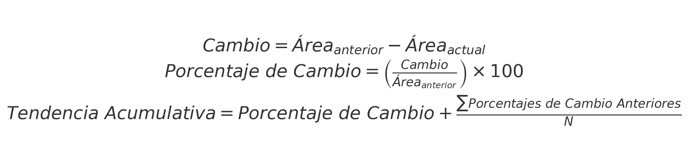
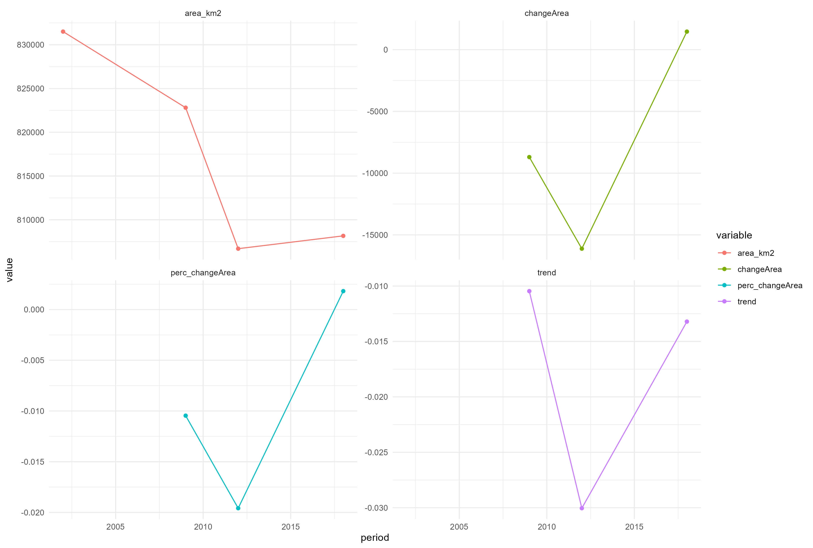

Esta rutina está diseñada para estimar el Indicador de Variación del Área de Ecosistemas Naturales Continentales en Colombia. Esto refleja la importancia de los hábitats continentales como factores vinculados a la estabilidad y función de los ecosistemas. Los cambios en el área de los ecosistemas naturales afectan directamente la capacidad de estos sistemas para mantener el flujo de procesos y la funcionalidad que los caracteriza.

Este índice proporciona información sobre los cambios en la extensión de coberturas naturales en ecosistemas naturales continentales, midiendo específicamente las variaciones de extensión respecto a un tiempo de referencia. La temporalidad de reporte de este índice es irregular, ya que depende de la actualización del insumo de coberturas naturales continentales para Colombia.

El ejemplo documentado estima genera resultados para el área total de Colombia (`input$studyArea = file.path(input_folder, "studyArea", "ColombiaDeptos.gpkg"`). Sin embargo, el código está diseñado para estimar el indicador en cualquier polígono espacial de Colombia. Por ejemplo, el script adjunto incluye un ejemplo para un departamento particular (`input$studyArea = file.path(input_folder, "studyArea", "antioquia.shp"`), que, al ser una ventana más pequeña, facilita la validación del código. Si se desea estimar el indicador para otro polígono, se debe cambiar la ruta `input$studyArea` en la [sección de código para la definición de entradas](#ID_inputs). Asimismo, el código admite diferentes insumos de cobertura por periodo y diferentes insumos de polígonos de ecosistemas estratégicos, siempre que se definan correctamente según lo descrito en la sección de entradas citada.


## Organizar directorio de trabajo
<a id="ID_seccion1"></a>

Las entradas de ejemplo de este ejercicio están almacenadas en [IAvH/Unidades compartidas/MBI/VariationNaturalEcosystemsArea/scripts](https://drive.google.com/open?id=1-kNyyptInMkeqaK5MGcMekZ0J49U-gJd&usp=drive_fs). Una vez descargadas, reemplaza la carpeta "input" en el directorio donde está guardado este código con la carpeta "input" de la descarga. El directorio está organizado de esta manera que facilita la ejecución del código:

```
script
│- Script_VariationNaturalEcosystemsArea
│    
└-input
│ │
│ └- studyArea
│ │   │
│ │   │- studyArea.shp
│ │ 
│ └- covs
│     │
│     │- NatCovs_tiempo_1.shp
│     │- ...
│     │- NatCovs_tiempo_n.shp
│     
└-output
```

## Establecer parámetros de sesión
### Cargar librerias/paquetes necesarios para el análisis
```{r,  eval=F, echo=T, results='hide', warning= F, message = F}
## Establecer parámetros de sesión ####
### Cargar librerias/paquetes necesarios para el análisis ####

#### Verificar e instalar las librerías necesarias ####
packagesPrev <- installed.packages()[,"Package"]  
packagesNeed <- c("this.path", "magrittr", "dplyr", "plyr", "pbapply", "sf", "ggplot2", 
                               "tidyr","openxlsx")  # Define los paquetes necesarios para ejecutar el codigo
new.packages <- packagesNeed[!(packagesNeed %in% packagesPrev)]  # Identifica los paquetes que no están instalados
if(length(new.packages)) {install.packages(new.packages, binary = TRUE)}  # Instala los paquetes necesarios que no están previamente instalados

#### Cargar librerías ####
lapply(packagesNeed, library, character.only = TRUE)  # Carga las librerías necesarias
```

## Establecer entorno de trabajo
El flujo de trabajo está diseñado para establecer el entorno de trabajo automáticamente a partir de la ubicación del código. Esto significa que tomará como `dir_work` la carpeta raiz donde se almacena el código “~/scripts. De esta manera, se garantiza que la ejecución se realice bajo la misma organización descrita en el paso de [Organizar directorio de trabajo](#ID_seccion1).

```{r,  eval=F, echo=T, results='hide', warning= F, message = F}
## Establecer entorno de trabajo ####
dir_work <- this.path::this.path() %>% dirname()  # Establece el directorio de trabajo
```


### Definir inputs y direccion output
Dado que el código está configurado para definir las entradas desde la carpeta input, en esta parte se debe definir una lista llamada input en la que se especifica el nombre de cada una de las entradas necesarias para su ejecución. Para este ejemplo, basta con usar file.path con referencia a `input_folder` y el nombre de los archivos para definir su ruta y facilitar su carga posterior. No obstante, se podría definir cualquier ruta de la máquina local como carpeta input donde se almacenen las entradas, o hacer referencia a cada archivo directamente.

Asimismo, el código genera una carpeta output donde se almacenarán los resultados del análisis. La ruta de esa carpeta se almacena por defecto en el mismo directorio donde se encuentra el código.

Este código ejecuta una serie de análisis espaciales a partir de polígonos. Es fundamental que los insumos sean polígonos y utilicen un sistema de coordenadas coherente. Todas las entradas espaciales deben tener el mismo sistema de coordenadas. En este flujo de trabajo, toda la información cartográfica se maneja en el sistema de coordenadas WGS84 (EPSG:4326). El código puede ejecutarse en cualquier sistema de coordenadas, siempre y cuando todos los insumos espaciales tengan la misma proyección. Se pueden usar distintos tipos de vectores espaciales (por ejemplo, .gpkg, .geoJson, .shp). En este ejemplo, se utiliza .gpkg por ser el más eficiente para análisis espaciales.

<a id="ID_inputs"></a>
```{r,  eval=F, echo=T, results='hide', warning= F, message = F}
### Definir entradas necesarias para la ejecución del análisis ####

# Definir la carpeta de entrada-insumos
input_folder<- file.path(dir_work, "input"); # "~/input"

# Crear carpeta output
output<- file.path(dir_work, "output"); dir.create(output)

#### Definir entradas necesarias para la ejecución del análisis ####
input <- list(
  studyArea= file.path(input_folder, "studyArea", "ColombiaDeptos.shp"),  # Ruta del archivo espacial que define el área de estudio
  timeNatCoverList= list( # Lista de rutas de archivos espaciales que representan coberturas naturales en diferentes años.  Cada elemento en la lista se nombra con el año correspondiente al que representa el archivo de cobertura natural. Esto permitira ordenarlos posteriormente
    "2002"= file.path(input_folder, "covs", "CLC_natural_2002.gpkg"), # Cobertura natural del año 2002 IDEAM
    "2009"= file.path(input_folder, "covs", "CLC_natural_2009.gpkg"), # Cobertura natural del año 2008 IDEAM
    "2012"= file.path(input_folder, "covs", "CLC_natural_2012.gpkg"),  # Cobertura natural del año 2009 IDEAM
    "2018"= file.path(input_folder, "covs", "CLC_natural_2018.gpkg") # Cobertura natural del año 2018 IDEAM
  )
)
```

La lista de entradas incluye `studyArea` como la ruta  al archivo espacial del área de estudio. Además, la entrada de lista `timeNatCoverList` compila las rutas de archivos espaciales de coberturas naturales en diferentes momentos. En este caso, se utilizaron los polígonos de coberturas naturales según la clasificación Corine Land Cover para Colombia, reportados por el IDEAM a escala 1:100k para los años 2002, 2009, 2012 y 2018 No se realiza procesamiento posterior a estos mapas, ya que el código asume que los poligonos de dichas entradas corresponden solo a coberturas naturales en esos periodos. Es importante que los nombres de cada elemento a cargar se especifiquen con años numéricos, ya que esto será útil para organizar el análisis de cambio y tendencias posterior.

## Cargar insumos

```{r,  eval=F, echo=T, results='hide', warning= F, message = F}
## Cargar insumos ####

# Este codigo maneja toda la informacion cartografica en el sistema de coordenadas WGS84 4326 https://epsg.io/4326
sf::sf_use_s2(F) # desactivar el uso de la biblioteca s2 para las operaciones geométricas esféricas. Esto optimiza algunos analisis de sf.

### Cargar area de estudio ####
studyArea<- terra::vect(input$studyArea) %>% terra::buffer(0) %>% terra::aggregate() %>% sf::st_as_sf() # se carga y se disuleve para optimizar el analisis

### Cargar coberturas ####
list_covs<- pblapply(input$timeNatCoverList, function(x) st_read(x))
list_covs<- list_covs[sort(names(list_covs))] # ordenar por año

#### Corte de coberturas por area de estudio ####
list_covs_studyArea<- pblapply(list_covs, function(NatCovs) {
  test_crop_studyArea<- NatCovs  %>%  st_crop( studyArea ) %>% sf::st_set_geometry("geometry") %>%   dplyr::summarise(across(geometry, ~ sf::st_combine(.)), .groups = "keep") %>%  dplyr::summarise(across(geometry, ~ sf::st_union(.)), .groups = "drop")
  test_intersects_studyArea<- sf::st_intersects(studyArea, test_crop_studyArea) %>% as.data.frame()
  NatCovs_studyArea<- st_intersection(studyArea[unique(test_intersects_studyArea$row.id),], test_crop_studyArea[unique(test_intersects_studyArea$col.id),])
})

```

Una vez cargados los insumos del área de estudio y las coberturas naturales en diferentes períodos de tiempo, se realiza el corte de esos mapas de coberturas naturales por el área de estudio. El objeto `list_covs_studyArea` corresponde a la representación espacial de esa intersección.

## Estimar area por periodo ####
Con los insumos ajustados al área de estudio, para estimar la variación de la extensión es necesario calcular el área de esas coberturas naturales en el área de estudio. Se calcula el área en km² para cada periodo y se almacena en tablas de área por periodo.

```{r,  eval=F, echo=T, results='hide', warning= F, message = F}
## Estimar area por periodo ####
area_cobsNat<- pblapply(names(list_covs_studyArea), function(i_testArea) {
  area_pol<-  list_covs_studyArea[[i_testArea]] %>% dplyr::mutate(period= i_testArea, area_km2= st_area(.) %>%  units::set_units("km2")) %>% 
    st_drop_geometry() %>% dplyr::group_by(period) %>% dplyr::summarise(area_km2= as.numeric(sum(area_km2, na.rm=T)))
  area_pol
  }) %>% plyr::rbind.fill()
print(area_cobsNat)
```

```{r,  eval= T, echo=F, warning= F, message = F, attr.output='style="max-height: 10px;"'}
output<- "C:/Repositories/MBI_Colombia/MBI/BI_subindex/Dimension_Function/Objective_Habitat/VariationNaturalEcosystemsArea/script/output_Colombia"
area_cobsNat<- openxlsx::read.xlsx( file.path(output, paste0("area_cobsNat", ".xlsx"))) 
knitr::kable(area_cobsNat)
```

Esto permite realizar un seguimiento de las variaciones en la extensión de los ecosistemas naturales continentales a lo largo del tiempo. Nuestro objetivo es estandarizar esa variación en un índice. Para ello, procedemos a estimar el cambio respecto a un periodo definido. En este caso, estimamos el cambio y el porcentaje de cambio de extensión respecto al último periodo anterior de medición, utilizando la fórmula de cambio: periodo anterior - periodo actual, y el porcentaje como el cambio sobre el periodo anterior.




Adicionalmente, calculamos la tendencia acumulativa de cambio, que refleja la tendencia general de los cambios a lo largo del tiempo. La tendencia acumulativa se obtiene sumando el porcentaje de cambio actual y la media de los porcentajes de cambio de los periodos anteriores, proporcionando una visión más integral de las tendencias a largo plazo en la extensión de los ecosistemas naturales.

```{r,  eval=F, echo=T, results='hide', warning= F, message = F}
## Estimar cambio respecto al periodo anterior y tendencia ####
changeArea_cobsNat<- area_cobsNat %>% dplyr::mutate(changeArea= NA, perc_changeArea= NA, trend=NA)

for(i in seq(nrow(changeArea_cobsNat)) ){
if(i>1){
  changeArea_cobsNat[i,"changeArea"]<- changeArea_cobsNat[i,"area_km2"]  - changeArea_cobsNat[i-1,"area_km2"] # estimar cambio en extension
  changeArea_cobsNat[i,"perc_changeArea"]<-  changeArea_cobsNat[i,"changeArea"] / changeArea_cobsNat[i-1,"area_km2"] # estimar cambio porcentual
  changeArea_cobsNat[i,"trend"]<-  changeArea_cobsNat[i,"perc_changeArea"] + ifelse(is.na(changeArea_cobsNat[i-1,"perc_changeArea"]), 0, mean(changeArea_cobsNat[2:(i-1),"perc_changeArea"], na.rm=T)) # estimar tendencia de cambio
  }
}
print(changeArea_cobsNat)
```


```{r,  eval= T, echo=F, warning= F, message = F, attr.output='style="max-height: 10px;"'}
output<- "C:/Repositories/MBI_Colombia/MBI/BI_subindex/Dimension_Function/Objective_Habitat/VariationNaturalEcosystemsArea/script/output_Colombia"
changeArea_cobsNat<- openxlsx::read.xlsx( file.path(output, paste0("changeArea_cobsNat", ".xlsx"))) 
knitr::kable(changeArea_cobsNat)
```

## Plot de cambio y tendencia ####

Por ultimo se ajustaron los resultados para visualización que permita entender las tendencias obtenidas. Esto permite observar los cambios en la extensión de los ecosistemas naturales y su tendencia acumulativa, lo que facilita la interpretación de los datos y apoya la toma de decisiones en la gestión de los recursos naturales.

```{r,  eval=F, echo=T, results='hide', warning= F, message = F}
## Plot de cambio y tendencia ####
changeArea_cobsNat_data<- changeArea_cobsNat %>% dplyr::mutate(period= as.numeric(period))

changeArea_cobsNat_plotdata<- tidyr::pivot_longer(changeArea_cobsNat_data, cols = -period, names_to = "variable", values_to = "value")

changeArea_plot<- ggplot(changeArea_cobsNat_plotdata, aes(x = period, y = value, color = variable)) +
  geom_line(group = 1) +
  geom_point() +
  facet_wrap(~ variable, scales = "free_y") +
  theme_minimal()

print(changeArea_plot)
```



Las áreas estimadas por periodos se presentan como valores absolutos, el cambio en área como el delta entre los periodos comparados, mientras que el porcentaje de cambio de área y la tendencia se representan en una escala entre -1 y 1. En esta escala, -1 representa una pérdida de extensión de coberturas naturales en ecosistemas continentales, y 1 indica que se mantuvo o se superó la extensión de referencia. Esto permite una interpretación clara y directa de los cambios y tendencias en la extensión de los ecosistemas naturales a lo largo del tiempo.


## Exportar resultados ####
```{r,  eval=F, echo=T, results='hide', warning= F, message = F}
# Exportar tablas
openxlsx::write.xlsx(area_cobsNat, file.path(output, paste0("area_cobsNat", ".xlsx")))
openxlsx::write.xlsx(changeArea_cobsNat, file.path(output, paste0("changeArea_cobsNat", ".xlsx")))
# Exportar figuras
ggsave(file.path(output, paste0("results_trend", ".jpg")), changeArea_plot)
```
